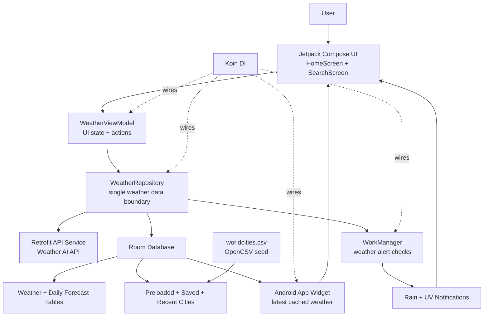
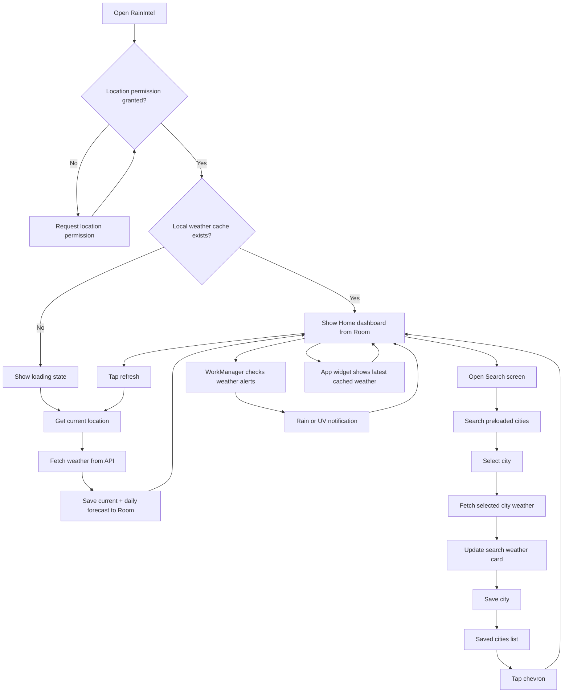

# RainIntel

RainIntel is an Android weather app that helps users quickly check current conditions, search cities, save favorite locations, and receive weather alerts. It combines live weather data with a local cache so the home screen, search experience, notifications, and app widget can reuse the same weather state.

## Architecture

RainIntel follows a simple MVVM + Repository architecture:



- **UI layer:** Jetpack Compose screens such as `HomeScreen` and `SearchScreen`.
- **State layer:** `WeatherViewModel` exposes loading, error, search, saved city, recent city, and weather UI state.
- **Data layer:** `WeatherRepository` coordinates API calls, Room cache reads/writes, city search, saved cities, and recent searches.
- **Local storage:** Room stores current weather, daily forecast rows, preloaded cities, and city weather snapshots.
- **Background work:** WorkManager runs weather alert checks and notification work.
- **Dependency injection:** Koin wires repositories, DAOs, ViewModels, workers, notifications, and widget helpers.

## User Flow



1. On first launch, the app requests location permission.
2. If cached weather exists, the home screen loads it immediately.
3. If the cache is empty, the app fetches weather for the current location and stores it locally.
4. Users can refresh the home screen to update weather from their current location.
5. Users can search preloaded cities, load weather for a selected city, and save cities.
6. Recent and saved cities can be reused to update the current weather view.
7. Weather alerts can notify the user about rain or high UV conditions.
8. The Android widget shows the app name, latest location, and current temperature from the local database.

## Features
- Weather alert notifications
- Home screen app widget
- Offline-friendly local cache with Room
- Current weather dashboard
- 7-day forecast
- City search from preloaded city data
- Recent searches
- Saved cities with edit/remove mode
- Current-location refresh

## Setup

RainIntel requires a Weather AI API key to fetch live weather data.

1. Create an API key from the Weather AI dashboard.
2. See the API docs: [weather-ai.co/docs](https://weather-ai.co/docs).
3. Add the key to `local.properties`:

```properties
WEATHER_API_KEY=wai_your_key_here
```

The app sends the key as a Bearer token when calling the Weather AI API.

## Widget Install Guide

The RainIntel widget shows the latest cached weather from the app database. It updates when the app is opened and weather is refreshed.

1. Install and open RainIntel at least once.
2. Grant location permission and refresh weather so the app can cache the latest forecast.
3. Go to the Android home screen.
4. Long-press an empty area on the home screen.
5. Tap **Widgets**.
6. Find **RainIntel**.
7. Drag the widget onto the home screen.
8. Tap the widget to open RainIntel.

If no weather has been cached yet, the widget shows `--°` and asks the user to open RainIntel to load weather.

## Tech Stack

- **Kotlin**
- **Jetpack Compose**
- **Material 3**
- **Navigation Compose**
- **Room**
- **Retrofit + OkHttp**
- **Koin**
- **WorkManager**
- **Coil**
- **OpenCSV**
- **MockK + JUnit**
